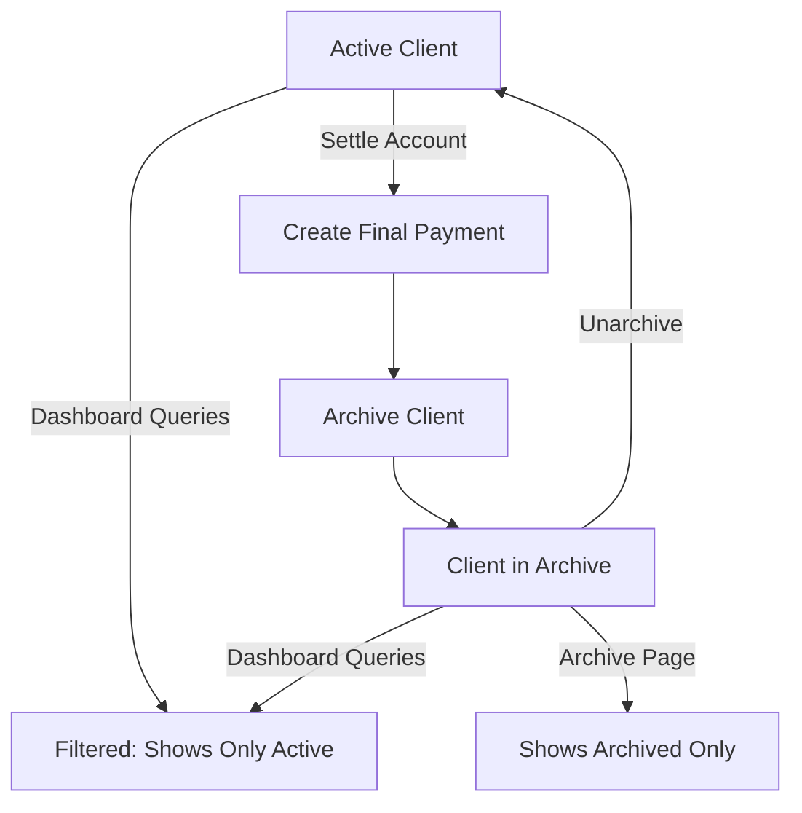

# 📦 Archive Feature (Soft Delete for Clients)

## Overview

The Archive feature allows you to "settle" client accounts by archiving them instead of permanently deleting. This keeps your main dashboard clean while preserving all historical data.

---

## 🎯 Features

### 1. **Soft Delete / Archive**
- Clients are moved to an archive instead of being deleted
- All work days and payments remain intact in the database
- Archived clients don't appear in:
  - Main dashboard calculations
  - Client selection dropdowns
  - Reports (unless viewing archive)

### 2. **Settle Account Flow**
- Create a final payment for the client
- Automatically archive the client after payment
- Add notes about why the account was settled
- Redirect to archive view after successful settlement

### 3. **Archive View**
- Dedicated tab in bottom navigation
- Shows all archived clients with:
  - Total earned (اللي ليا)
  - Total received (وصلني)
  - Final balance
  - Number of work days
  - Archive date and notes
- Expand/collapse to view details
- Unarchive option to restore clients

---

## 📋 Setup Instructions

### Step 1: Run Database Migration

Execute the SQL file in Supabase SQL Editor:

```bash
supabase/archived_clients_migration.sql
```

This creates:
- `archived_clients` table
- Row Level Security policies
- Indexes for performance

### Step 2: Deploy the Application

The code is ready to use! No environment variables needed.

---

## 🔄 User Flow

### Archiving a Client (Settle Account)

1. Navigate to **Home** → **تصفية حساب عميل** (Settle Account)
2. Select the client from dropdown
3. Enter final payment details:
   - Date
   - Amount
   - Payment method
   - Payment notes (optional)
4. Add archive notes (optional) - why you're settling this account
5. Click **"تصفية الحساب وأرشفة العميل"**
6. System will:
   - ✅ Create the final payment record
   - ✅ Move client to archive
   - ✅ Remove client from active lists
   - ✅ Redirect to archive page

### Viewing Archived Clients

1. Navigate to **الأرشيف** (Archive) tab in bottom navigation
2. See all archived clients with summary
3. Click on any client to expand and see:
   - Financial summary
   - Work days count
   - Archive notes
   - **Unarchive** button

### Unarchiving a Client

1. Go to Archive page
2. Expand the client card
3. Click **"إلغاء الأرشفة"** (Unarchive)
4. Client will be restored to active status
5. Page refreshes to show updated list

---

## 🗄️ Database Schema

### `archived_clients` Table

```sql
id                uuid primary key
user_id           uuid not null (references auth.users)
client_name       text not null
archived_at       timestamptz not null (auto: now())
final_payment_id  uuid null
notes             text null
created_at        timestamptz not null (auto: now())

UNIQUE (user_id, client_name)
```

### Indexes

- `user_id` - for fast user-specific queries
- `(user_id, client_name)` - for quick lookups

---

## 🔒 Security

### Row Level Security (RLS)

All policies ensure users can only:
- View their own archived clients
- Archive their own clients
- Unarchive their own clients
- Delete their own archives (if needed)

### Query Filtering

The system automatically filters:
- `getDashboardData()` - excludes archived clients
- `getClientNames()` - excludes archived clients
- `getReportsData()` - excludes archived clients (can be modified if needed)

---

## 📊 Data Flow



---

## 🛠️ Technical Details

### Server Actions

**`app/actions/clients.ts`**
- `archiveClientAction()` - Archive a client
- `unarchiveClientAction()` - Restore a client
- `getArchivedClients()` - Fetch all archived clients
- `getClientStats()` - Calculate client statistics

### Components

**`components/archive/`**
- `ArchiveContent.tsx` - Server component for archive page
- `ArchiveClient.tsx` - Client component for expandable archive cards

**`components/forms/`**
- `SettleAccountForm.tsx` - Combined payment + archive form

### Pages

- `/archive` - View all archived clients
- `/settle` - Settle account and archive client

---

## 💡 Best Practices

### When to Archive

Archive clients when:
- ✅ Project is completed
- ✅ Final payment is made
- ✅ No longer working with the client
- ✅ Want to clean up active client list

### When NOT to Archive

Don't archive if:
- ❌ Client is temporarily inactive (they might return)
- ❌ You still need the client in reports
- ❌ Payment is pending (settle first)

### Notes Recommendations

Add meaningful notes like:
- "Project completed successfully"
- "Client moved to different location"
- "Final settlement - no outstanding balance"
- "Business closed"

---

## 🔍 Testing

### Test Scenarios

1. **Archive Flow**
   ```
   - Create work days for a client
   - Create some payments
   - Settle account with final payment
   - Verify client moved to archive
   - Check dashboard no longer shows client
   ```

2. **Unarchive Flow**
   ```
   - Open archive page
   - Expand a client
   - Click unarchive
   - Verify client appears in dropdowns again
   ```

3. **Security**
   ```
   - Login as User A
   - Archive a client
   - Login as User B
   - Verify User B cannot see User A's archives
   ```

---

## 🚀 Future Enhancements

Potential improvements:
- [ ] Bulk archive multiple clients
- [ ] Archive reports with date ranges
- [ ] Export archived client data to PDF
- [ ] Automatic archiving after X months of inactivity
- [ ] Archive categories/tags
- [ ] Search within archived clients

---

## ❓ Troubleshooting

### Client still shows in dashboard after archiving

**Solution:** Refresh the page or check browser cache

### Cannot unarchive client

**Solution:** 
1. Check browser console for errors
2. Verify RLS policies are active in Supabase
3. Ensure migration was run successfully

### Archive page is empty but I archived clients

**Solution:**
1. Check Supabase logs for query errors
2. Verify `archived_clients` table exists
3. Run migration script again if needed

---

## 📞 Support

For issues or questions:
1. Check Supabase logs in Dashboard
2. Check browser console (F12)
3. Verify `.env.local` has correct Supabase keys
4. Review `SECURITY_SETUP.md` for RLS configuration
