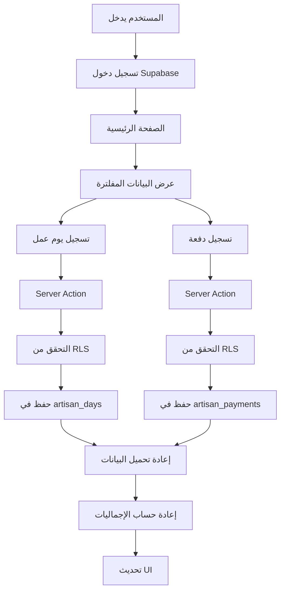

# 📚 دليل شامل لتطبيق دفتر الصنايعي

## 🎯 نبذة عن التطبيق

**دفتر الصنايعي** هو تطبيق ويب مخصص لمساعدة العمالة الماهرة (السباكين، الكهربائيين، النجارين، إلخ) في إدارة أعمالهم وحساباتهم المالية.

---

## 🏗️ البزنس والفكرة الأساسية

### المشكلة التي يحلها التطبيق
- **إدارة الأعمال اليومية:** تسجيل أيام العمل والأجور
- **متابعة المدفوعات:** تسجيل الدفعات الواردة من العملاء
- **حساب المستحقات:** معرفة الأموال المستحقة والباقية
- **إدارة العملاء:** أرشفة العملاء بعد انتهاء المشاريع
- **التقارير والإحصائيات:** تحليل الأداء المالي والعملي

### الجمهور المستهدف
- العمالة الماهرة في قطاع البناء والصيانة
- الصنايعيين الذين يعملون مع عملاء متعددين
- أي شخص يريد إدارة أعماله بطريقة منظمة

---

## 🔄 رحلة المستخدم (User Journey)

### 1. تسجيل الدخول والبداية
```
المستخدم → يفتح التطبيق → تسجيل دخول → الصفحة الرئيسية
```

### 2. الصفحة الرئيسية (Dashboard)
**العرض الأساسي:**
- **المالية:**
  - المستحقات: إجمالي المستحقات
  - وصلني: إجمالي المدفوعات الواردة
  - باقي ليا: الفرق (المستحقات - المدفوعات)

- **إحصائيات العمل:**
  - عدد أيام العمل الكاملة
  - عدد أيام العمل النصف
  - عدد أيام الإجازات

- **آخر المدفوعات:**
  - قائمة بأحدث 5 مدفوعات
  - إمكانية تعديل أو حذف

### 3. تسجيل يوم عمل
**الحقول المطلوبة:**
- التاريخ
- الأجر اليومي (بالريال)
- الحالة (يوم كامل، نصف يوم، إجازة)
- نوع المهنة
- اسم العميل
- الموقع (اختياري)
- ملاحظات (اختياري)

### 4. تسجيل دفعة
**الحقول المطلوبة:**
- التاريخ
- المبلغ
- اسم العميل
- طريقة الدفع (نقدي، تحويل بنكي)
- ملاحظات (اختياري)

### 5. التقويم
- عرض شهري لجميع أيام العمل
- تمييز لوني حسب حالة اليوم:
  - أزرق: يوم كامل
  - أصفر: نصف يوم
  - أحمر: إجازة
- إمكانية الضغط على أي يوم لعرض التفاصيل

### 6. التقارير
**الفلاتر المتاحة:**
- فلترة بالعميل
- فلترة بالحالة
- فلترة بالفترة الزمنية

**الإحصائيات:**
- ملخص مالي للفترة المحددة
- إحصائيات شهرية تفصيلية
- مقارنة الإيرادات والمدفوعات

### 7. تصفية الحساب
عملية أرشفة العميل بعد انتهاء التعامل معه:
- تسجيل دفعة نهائية
- أرشفة العميل تلقائياً
- إضافة ملاحظات للأرشفة

### 8. الأرشيف
- عرض جميع العملاء المؤرشفين
- إحصائيات مالية لكل عميل
- إمكانية إلغاء الأرشفة

### 9. الإعدادات
- تسجيل الخروج
- إعدادات عامة (قيد التطوير)

---

## 🏗️ البنية التقنية للتطبيق

### التقنيات المستخدمة
- **Frontend:** Next.js 15 (React Framework)
- **Styling:** Tailwind CSS
- **Database:** Supabase (PostgreSQL)
- **Authentication:** Supabase Auth
- **UI Components:** Lucide React Icons
- **Forms:** React Hook Form + Zod
- **Notifications:** Sonner (Toast)

### هيكل المشروع

```
artisan-ledger/
├── 📱 app/                          # Next.js App Router
│   ├── (app)/                       # الصفحات المحمية
│   │   ├── page.tsx                 # الصفحة الرئيسية
│   │   ├── calendar/                # التقويم
│   │   ├── work/                    # تسجيل العمل
│   │   ├── payment/                 # تسجيل المدفوعات
│   │   ├── reports/                 # التقارير
│   │   ├── archive/                 # الأرشيف
│   │   ├── settle/                  # تصفية الحساب
│   │   └── settings/                # الإعدادات
│   ├── actions/                     # Server Actions
│   │   ├── days.ts                  # عمليات أيام العمل
│   │   ├── payments.ts              # عمليات المدفوعات
│   │   └── clients.ts               # عمليات الأرشيف
│   └── auth/                        # التوثيق
├── 🧩 components/                   # المكونات القابلة لإعادة الاستخدام
│   ├── dashboard/                   # مكونات الصفحة الرئيسية
│   ├── calendar/                    # مكونات التقويم
│   ├── forms/                       # النماذج
│   ├── reports/                     # مكونات التقارير
│   ├── archive/                     # مكونات الأرشيف
│   ├── settings/                    # مكونات الإعدادات
│   ├── layout/                      # مكونات التخطيط
│   └── ui/                          # مكونات UI عامة
├── 📚 lib/                          # المكتبات والوظائف المساعدة
│   ├── supabase.ts                  # إعداد Supabase
│   ├── data.ts                      # جلب البيانات
│   ├── calculations.ts              # الحسابات المالية
│   ├── database.types.ts            # أنواع البيانات
│   ├── validations.ts               # التحقق من البيانات
│   ├── format.ts                    # تنسيق البيانات
│   └── constants.ts                 # الثوابت
└── 🗄️ supabase/                    # ملفات قاعدة البيانات
    ├── rls_policies.sql             # سياسات الأمان
    └── archived_clients_migration.sql # ميزة الأرشيف
```

---

## 🗄️ قاعدة البيانات

### الجداول الرئيسية

#### 1. جدول `artisan_days` (أيام العمل)
```sql
CREATE TABLE artisan_days (
  id UUID PRIMARY KEY,
  user_id UUID NOT NULL,
  date DATE NOT NULL,
  daily_rate DECIMAL(10,2) NOT NULL,
  status TEXT NOT NULL, -- 'Full Day', 'Half Day', 'Holiday'
  profession_type TEXT NOT NULL,
  client_name TEXT NOT NULL,
  location TEXT,
  notes TEXT,
  created_at TIMESTAMPTZ DEFAULT NOW(),
  UNIQUE(user_id, date)
);
```

#### 2. جدول `artisan_payments` (المدفوعات)
```sql
CREATE TABLE artisan_payments (
  id UUID PRIMARY KEY,
  user_id UUID NOT NULL,
  date DATE NOT NULL,
  amount DECIMAL(10,2) NOT NULL,
  client_name TEXT NOT NULL,
  payment_method TEXT NOT NULL, -- 'Cash', 'Bank Transfer'
  notes TEXT,
  created_at TIMESTAMPTZ DEFAULT NOW()
);
```

#### 3. جدول `archived_clients` (العملاء المؤرشفين)
```sql
CREATE TABLE archived_clients (
  id UUID PRIMARY KEY,
  user_id UUID NOT NULL,
  client_name TEXT NOT NULL,
  archived_at TIMESTAMPTZ DEFAULT NOW(),
  final_payment_id UUID,
  notes TEXT,
  created_at TIMESTAMPTZ DEFAULT NOW(),
  UNIQUE(user_id, client_name)
);
```

### سياسات الأمان (RLS)
كل جدول محمي بـ Row Level Security بحيث:
- كل مستخدم يرى بياناته فقط
- لا يمكن الوصول لبيانات مستخدمين آخرين
- جميع العمليات (القراءة، الإضافة، التعديل، الحذف) محمية

---

## 🧮 الحسابات والمعادلات

### الحسابات الأساسية

#### 1. حساب إجمالي المستحقات (المستحقات)
```typescript
function calculateTotalEarned(workDays: ArtisanDayRow[]): number {
  return workDays.reduce((total, day) => {
    switch (day.status) {
      case 'Full Day':
        return total + day.daily_rate;
      case 'Half Day':
        return total + (day.daily_rate / 2);
      case 'Holiday':
        return total; // لا يضاف شيء
      default:
        return total;
    }
  }, 0);
}
```

#### 2. حساب إجمالي المدفوعات (وصلني)
```typescript
function calculateTotalReceived(payments: ArtisanPaymentRow[]): number {
  return payments.reduce((total, payment) => total + payment.amount, 0);
}
```

#### 3. حساب الرصيد المتبقي (الباقي ليا)
```typescript
function calculateRemainingBalance(earned: number, received: number): number {
  return earned - received;
}
```

### إحصائيات العمل
```typescript
function calculateDayStats(workDays: ArtisanDayRow[]) {
  return {
    fullDays: workDays.filter(d => d.status === 'Full Day').length,
    halfDays: workDays.filter(d => d.status === 'Half Day').length,
    offDays: workDays.filter(d => d.status === 'Holiday').length,
  };
}
```

---

## 🔒 الأمان والحماية

### طبقات الحماية

#### 1. المصادقة (Authentication)
- استخدام Supabase Auth
- تشفير كلمات المرور
- جلسات آمنة
- تسجيل خروج تلقائي عند انتهاء الجلسة

#### 2. التحقق من الهوية (Authorization)
```typescript
// في كل Server Action
const { data: { user }, error } = await supabase.auth.getUser();
if (error || !user) {
  throw new Error("Unauthorized");
}
```

#### 3. Row Level Security (RLS)
```sql
-- مثال: سياسة عرض أيام العمل
CREATE POLICY "Users can view their own days"
  ON public.artisan_days
  FOR SELECT
  USING (auth.uid() = user_id);
```

#### 4. التحقق من البيانات (Validation)
```typescript
// استخدام Zod للتحقق
const workSessionSchema = z.object({
  date: z.string().min(1),
  daily_rate: z.number().min(0),
  status: z.enum(['Full Day', 'Half Day', 'Holiday']),
  // ...
});
```

#### 5. Unique Constraints
```sql
-- منع تسجيل يومين في نفس التاريخ لنفس المستخدم
UNIQUE(user_id, date)
```

---

## 🎨 التصميم وتجربة المستخدم

### نظام الألوان
```css
:root {
  --primary: #0d9488;      /* تركوازي - الأزرار الرئيسية */
  --success: #10b981;      /* أخضر - المدفوعات والنجاح */
  --warning: #f59e0b;      /* أصفر - التحذيرات والباقي */
  --danger: #ef4444;       /* أحمر - الأخطاء والحذف */
  --info: #0ea5e9;         /* أزرق - المعلومات */
}
```

### التخطيط (Layout)
- **Mobile-First:** التصميم يبدأ من الموبايل ثم يتكيف للشاشات الأكبر
- **Responsive:** يعمل على جميع أحجام الشاشات
- **RTL Support:** دعم الكتابة من اليمين لليسار
- **Accessibility:** إمكانية الوصول للمعاقين

### مكونات UI
- **Cards:** بطاقات لعرض المعلومات
- **Forms:** نماذج تفاعلية بتحقق فوري
- **Modals:** نوافذ منبثقة للتأكيد
- **Toast Notifications:** إشعارات للنجاح/الفشل
- **Skeletons:** شاشات تحميل تفاعلية

---

## 📊 الميزات المتقدمة

### 1. ميزة الأرشيف (Archive)
**الهدف:** إخفاء العملاء المنتهيين من القوائم الرئيسية مع الحفاظ على البيانات

**آلية العمل:**
1. المستخدم يختار "تصفية حساب عميل"
2. يسجل الدفعة النهائية
3. يضيف ملاحظات للأرشفة
4. التطبيق ينقل العميل لجدول `archived_clients`
5. العميل يختفي من القوائم العادية
6. يظهر في صفحة الأرشيف مع الإحصائيات

**الفوائد:**
- ✅ تنظيف القوائم الرئيسية
- ✅ الحفاظ على البيانات التاريخية
- ✅ إمكانية الاستعلام عن الأرباح من كل عميل
- ✅ إمكانية إلغاء الأرشفة إذا عاد العميل

### 2. التقارير الذكية
**الفلترة المتقدمة:**
- فلترة بالعميل
- فلترة بنوع العمل (كامل/نصف/إجازة)
- فلترة بالفترة الزمنية
- دمج الفلاتر للحصول على تقارير مخصصة

**الإحصائيات الشهرية:**
- إيرادات كل شهر
- مدفوعات كل شهر
- عدد أيام العمل
- متوسط الأجر اليومي

### 3. التقويم التفاعلي
- عرض شهري كامل
- تلوين الأيام حسب الحالة
- تفاصيل فورية عند الضغط
- إمكانية التعديل المباشر

---

## 🔄 دورة حياة البيانات



---

## 🛠️ الإعداد والتشغيل

### متطلبات النظام
- Node.js 18+
- npm أو yarn
- حساب Supabase

### خطوات التشغيل

#### 1. تحميل المشروع
```bash
git clone https://github.com/username/artisan-ledger.git
cd artisan-ledger
```

#### 2. تثبيت المكتبات
```bash
npm install
```

#### 3. إعداد متغيرات البيئة
```bash
# إنشاء ملف .env.local
NEXT_PUBLIC_SUPABASE_URL=your_supabase_url
NEXT_PUBLIC_SUPABASE_ANON_KEY=your_supabase_anon_key
```

#### 4. إعداد قاعدة البيانات
```sql
-- في Supabase SQL Editor
-- تشغيل ملف: supabase/COMPLETE_SETUP.sql
```

#### 5. تشغيل التطبيق
```bash
npm run dev
```

### إعداد الإنتاج
```bash
npm run build
npm start
```

---

## 🚀 خطط التطوير المستقبلية

### المرحلة القادمة (v2.0)
- [ ] تطبيق موبايل (React Native)
- [ ] تصدير التقارير لـ PDF/Excel  
- [ ] إضافة المزيد من المهن
- [ ] تتبع المواد والمصروفات
- [ ] إشعارات للمدفوعات المتأخرة
- [ ] نظام عملات متعدد

### ميزات متقدمة
- [ ] AI لتحليل الأداء
- [ ] تكامل مع البنوك
- [ ] فاتورة إلكترونية
- [ ] تطبيق للعملاء
- [ ] GPS لتتبع المواقع

---

## 📞 الدعم والمساعدة

### المشاكل الشائعة

#### مشكلة: "يوجد يوم عمل مسجّل بالفعل في هذا التاريخ"
**الحل:** تشغيل `supabase/fix_unique_constraints.sql`

#### مشكلة: "Could not find table 'archived_clients'"
**الحل:** تشغيل `supabase/archived_clients_migration.sql`

#### مشكلة: المستخدمون يرون بيانات بعض
**الحل:** تشغيل `supabase/rls_policies.sql`

### الحصول على المساعدة
1. مراجعة ملفات التوثيق في المشروع
2. فحص Browser Console (F12)
3. مراجعة Supabase Logs
4. التأكد من إعدادات `.env.local`

---

## 📈 إحصائيات المشروع

### بيانات التطوير
- **سطور الكود:** ~5,000 سطر
- **عدد الملفات:** ~50 ملف
- **المكونات:** ~30 مكون
- **الصفحات:** 8 صفحات
- **Server Actions:** 12 action

### الأداء
- **وقت التحميل:** < 2 ثانية
- **حجم البناء:** ~1.5 MB
- **متوافق مع:** Chrome, Firefox, Safari, Edge
- **دعم الموبايل:** ✅ كامل

---

## 💡 نصائح للاستخدام الأمثل

### للمستخدمين
1. **سجل أعمالك يومياً** لتجنب النسيان
2. **استخدم ملاحظات واضحة** لكل عمل
3. **تابع رصيدك بانتظام** لتجنب تأخير المدفوعات
4. **أرشف العملاء** بعد انتهاء المشاريع
5. **استخدم التقارير** لتحليل أدائك

### للمطورين
1. **اتبع هيكل Next.js App Router**
2. **استخدم TypeScript** لجميع الملفات
3. **اكتب Server Actions آمنة** مع RLS
4. **اختبر على الموبايل** دائماً
5. **وثق تغييراتك** في الكود

---

## 📚 المراجع والمصادر

### التقنيات المستخدمة
- [Next.js Documentation](https://nextjs.org/docs)
- [Supabase Documentation](https://supabase.io/docs)
- [Tailwind CSS](https://tailwindcss.com/docs)
- [TypeScript Handbook](https://www.typescriptlang.org/docs/)

### الأدوات المساعدة
- [Lucide Icons](https://lucide.dev/)
- [Zod Validation](https://github.com/colinhacks/zod)
- [Sonner Toast](https://sonner.emilkowal.ski/)

---

## 🏁 الخلاصة

**دفتر الصنايعي** هو حل شامل لإدارة أعمال وحسابات العمالة الماهرة. يتميز بالبساطة في الاستخدام والقوة في الإمكانيات، مع التركيز على الأمان وحماية البيانات.

التطبيق مبني بأحدث التقنيات ويتبع أفضل الممارسات في تطوير الويب، مما يجعله قابلاً للتطوير والصيانة على المدى الطويل.

**الهدف الأساسي:** مساعدة الصنايعية على إدارة أعمالهم بكفاءة أكبر والتركيز على ما يجيدونه بدلاً من الإجراءات الإدارية المعقدة.

---

**تاريخ إنشاء التوثيق:** ديسمبر 2024  
**الإصدار:** 1.0.0  
**حالة المشروع:** مكتمل ومجهز للاستخدام

---

*هذا التوثيق قابل للتحويل إلى PDF باستخدام أدوات مثل Pandoc أو أي محول Markdown إلى PDF*